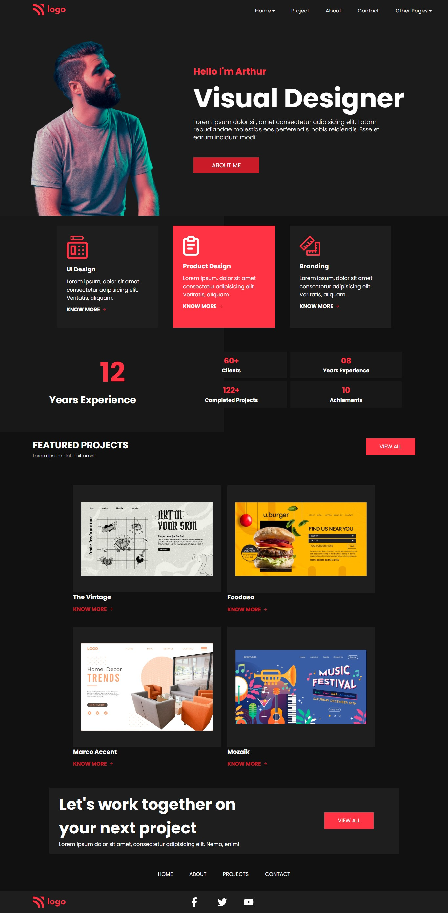

# Assignment 1

## Project 15 [Live Link](https://nachiketkeripaleproject15.netlify.app/)

- Build this project from strach.
- Used Flex in this project.
- Learnt to align multiple section.
- Used Svg icons from (Fontawesomeicons)[https://fontawesomeicons.com/]
- Used svg images.
- Used Goolge Fonts for this project.

---

## Time taken to finish this project

-   6 hour to complete it.

#### Screenshot

 

